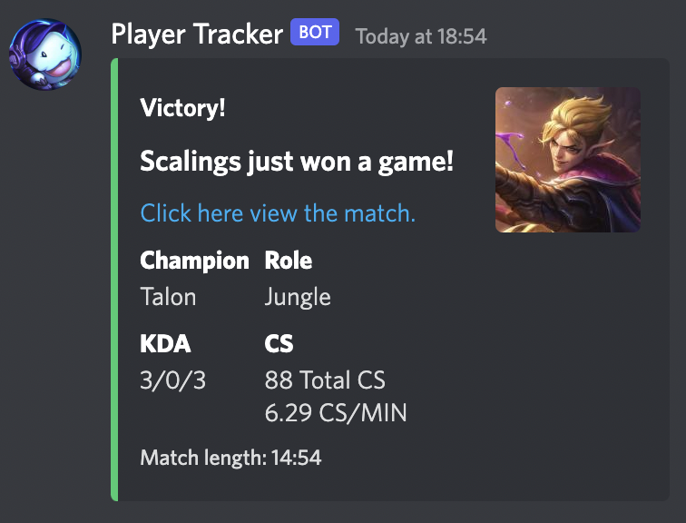
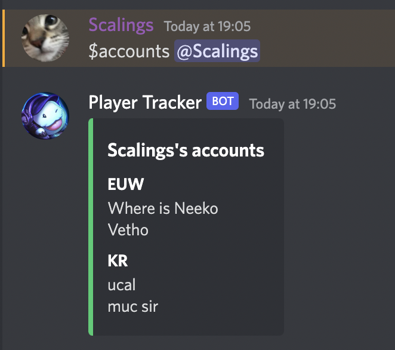
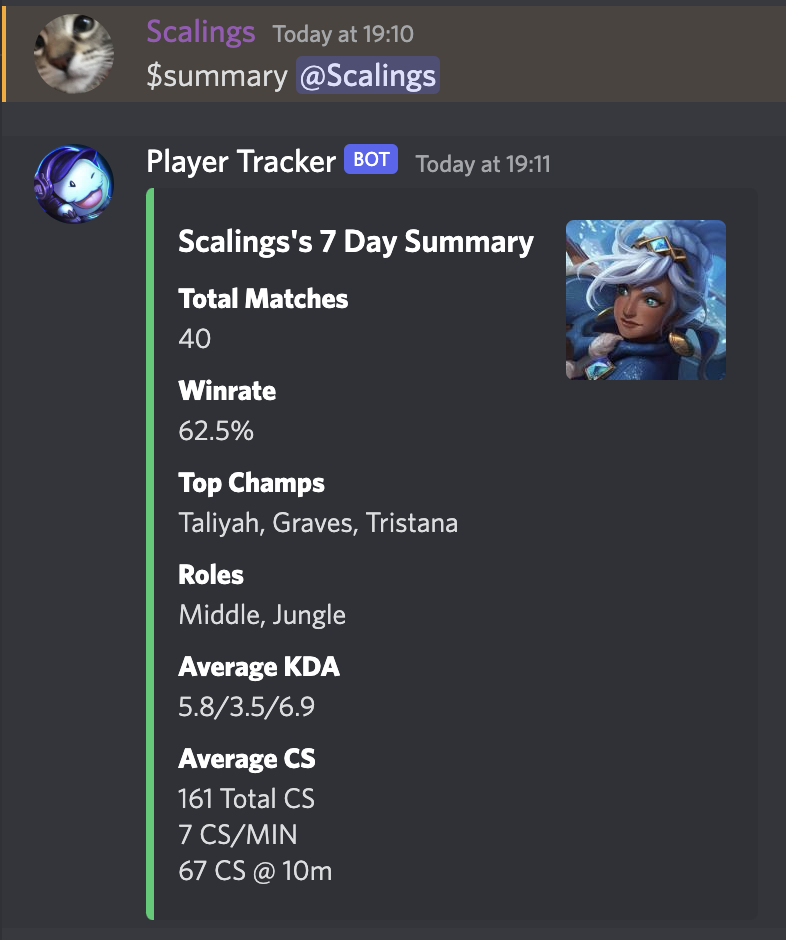
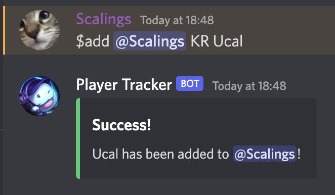
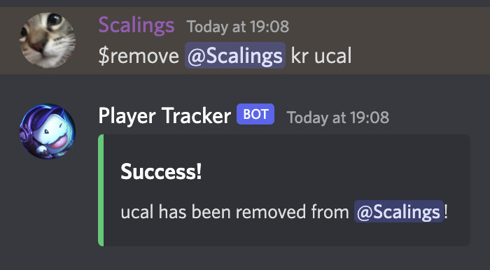

# League-Player-Tracker-1.0
### About
A discord bot utilising the Riot API to track a players matches across multiple accounts and summarise it. Ideal for use in esports teams to increase efficency.

### Features
- Track multiple accounts from different regions per user. 
- Check for new games every 5 minuites. 
- Provides useful information and a summary after each game.
- Provides a weekly summary per player.
- Remove accounts from a player.

<p align="middle">





</p>

### Requirements
This program requires several depenancies. To install them use the following command.
`pip install discord.py dnspython certifi pymongo python-dotenv requests`

### Setup Guide
To run you need to create a .env file.
```
API_KEY_1= Discord App Key
API_KEY_2= Riot API Key
USERNAME= MongoDB Username
PASSWORD= MongoDB Password
DATABASE= MondoDB Database
```

### How to run
After setup you just need to run by doing `python3 app.py`. 
